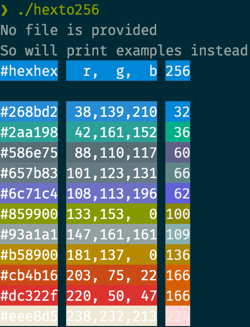

# hexto256
Read series of hex color code like `#000000` and `#ffffff` and convert these to 256 code (RGB is bonus) and print them in their color.

Heavy lifting is done by https://github.com/gookit/color.

## Example



## Install

```bash
go install github.com/ryuheechul/hexto256
```

## Prerequisite

It can be configured easily via [devenv.nix](./devenv.nix) (powered by https://devenv.sh/)

_or just typical golang environment should be sufficient_

## Development

```bash
# try out
go run .
# or
go run ./example.hex.txt

# build
go build
```
