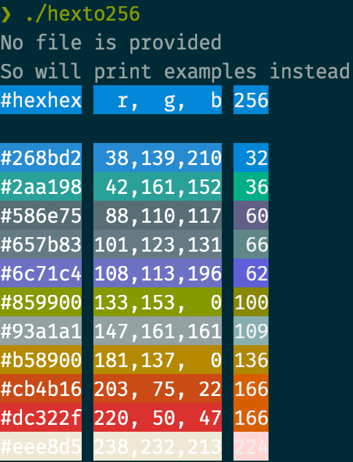
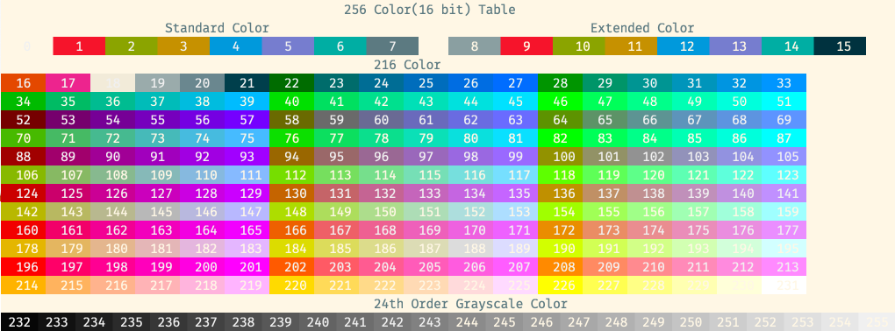
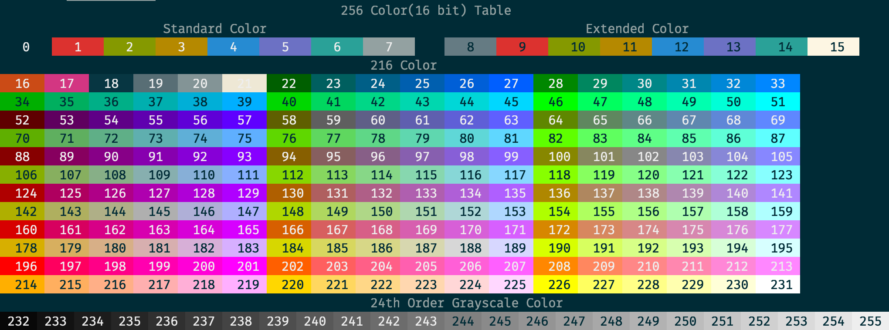

# hexto256
Read series of hex color code like `#000000` and `#ffffff` and convert these to 256 code (RGB is bonus) and print them in their color.

Heavy lifting is done by https://github.com/gookit/color.

## Example



## Rationale

The purpose is to work out corresponding 256 color from hex code - [true color](https://en.wikipedia.org/wiki/Color_depth#True_color_(24-bit)).

Unlike true color, 256 color can vary depends on your terminal/shell environment and that's exactly why this tool exist to translate and preview to see if any color is usable for specific color palette.
(This is probably more true for 0-21 though - at least for my env - so anything over that color should be consistent)

Which you can see below via https://github.com/gookit/color/blob/master/_examples/color_256.go for my two different theme.




## Usages
```bash
# print example
hexto256

# print with file
hexto256 your/hex/file # make sure to have a hex code per line

# print from /dev/stdin via piping - single line
echo '#123def' | ./hexto256 /dev/stdin

# print from /dev/stdin via piping - multiple lines
cat <<EOF | hexto256 /dev/stdin
#000000
#123def
#ffffff
EOF
```

Or you could use something like this script to https://gist.github.com/wilfm/6f9b78a0db3553141757 extract from an arbitrary file like this one, https://github.com/dandavison/delta/blob/master/src/colors.rs

```bash
# assuming the script is downloaded as ./grephex and so is ./colors.rs for a target file
./grephex colors.rs | hexto256 /dev/stdin

# Same thing but with a different file, https://github.com/git/git/blob/master/contrib/diff-highlight/README
./grephex README | hexto256 /dev/stdin
```

## Install

```bash
go install github.com/ryuheechul/hexto256
```

## Prerequisite

It can be configured easily via [devenv.nix](./devenv.nix) (powered by https://devenv.sh/)

_or just typical golang environment should be sufficient_

## Development

```bash
# try out
go run .
# or
go run ./example.hex.txt

# build
go build
```
